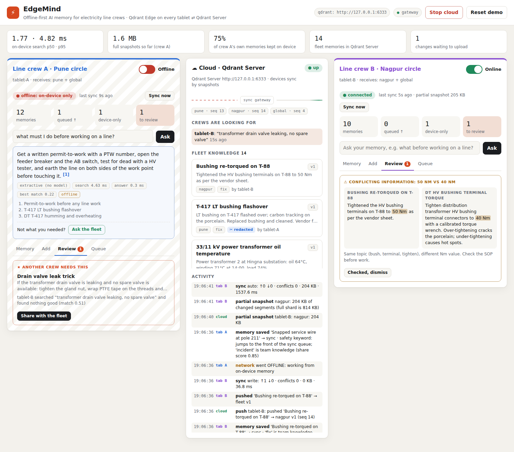

# EdgeMind ⚡ Offline-first AI memory for electricity line crews

**Code Cubicle 6.0 · Problem Statement 03 · Qdrant Edge on every node ⇄ Qdrant Server**

Line crews at power distribution companies (DISCOMs) fix transformers, feeders and poles where mobile signal
comes and goes. The knowledge they need (safety procedures, past fixes, what worked last monsoon) lives in
people's heads, WhatsApp groups and paper registers.

EdgeMind puts a **searchable AI memory on every crew's edge node** (the van box / tablet) with Qdrant Edge. Crew
phones talk to their node over local Wi-Fi, so it answers with **no cloud at all**. When the uplink returns it
**decides what the rest of the fleet should know**, syncs through Qdrant Server, and **flags conflicting
information** before someone acts on it. Every phone, laptop and the control-room screen update **live**.



## What judges can do in the room

| | Try it | What happens |
|---|---|---|
| **Join from your phone** | Scan the QR on the big screen, pick a crew | You get that crew's field app. Ask, add, review; the big screen updates as you tap |
| **Live fleet** | Add a fix on crew A | It is searchable on crew B's node in **~0.3 s** (measured and shown on screen), with no manual sync |
| **Kill the signal** | Flip a node's *Uplink* off (or pull the Wi-Fi on a laptop node) | Ask still answers in milliseconds from the node's own Qdrant Edge shards; writes queue, safety items first |
| **Kill the cloud** | *Stop cloud* really terminates Qdrant Server and the gateway | Every node keeps working; queues drain in priority order on *Start cloud* |
| **Fleet demand** | Crew B asks something it can't answer → *Ask the fleet* | Within ~0.3 s crew A's phone pops **★ Another crew needs this**: its *private* note. One tap shares it |
| **Conflicting facts** | Write "tightened bushing terminals to 50 Nm" | Flagged instantly against the SOP that says 40 Nm, offline |
| **Privacy** | Write a note with a phone number / PIN | PINs never leave the node; PII goes to the fleet redacted; the original stays local |
| **Elastic fleet** | *+ Edge node*, or run one command on a second laptop | A new node enrolls with the join code, bootstraps from a snapshot and goes live on the map |
| **Ask in Hindi or Marathi** | "लाइन पर काम शुरू करने से पहले क्या करना चाहिए?" | Cross-lingual retrieval finds the English permit-to-work SOP in ~20 ms; the on-node AI answers in plain English with a citation |
| **AI that admits it doesn't know** | Ask something no crew has written down | The local LLM says *not in this node's memory* and highlights *Ask the fleet*, instead of inventing an answer |
| **Photo evidence** | 📷 a burnt bushing, or a photo on another screen | CLIP runs on the node; the photo is searchable by words ("burnt bushing") and by photo ("seen this before?"), offline. A thumbnail and its vector reach the fleet live; the full photo stays on the node |
| **Why did this rank?** | Search in the Memory tab | Every result shows its meaning / keyword / photo score and the fused score; filter chips show native Qdrant facet counts |
| **How did this memory evolve?** | 🕘 history on any memory | Every version the node has seen: created, edited here, received from crew B, merged, deleted |
| **Scale** | ⚡ 20k scale test on a node | Builds a 20,000-memory Qdrant Edge shard on the spot and times the real hybrid pipeline: **~2.4 ms p50** |

## Architecture

```
 Crew phones (any browser)          Hub laptop / cloud VM                               Another laptop (optional)
 ┌───────────────┐   Wi-Fi   ┌──────────────────────────────────────────────┐   LAN    ┌──────────────────────────┐
 │ field app  /m │◄─────────►│ Console :8000  dashboard · field app · proxy │◄────────►│ edge node (launch.py join)│
 └───────────────┘   SSE     │   └ live aggregator (SSE fan-out)            │   SSE    │  own Qdrant Edge shards   │
                             │ Gateway :8100  enroll · tokens · site ACL    │◄────────►│  field app for its crew   │
                             │   compare-and-set · seq nos · fleet demand   │          └──────────────────────────┘
                             │   live push channel · snapshot proxy (gzip)  │
                             │ Qdrant Server :6333 (loopback only)          │
                             │ Edge nodes tablet-A, tablet-B, … (processes) │
                             │   each: mutable shard + mirror shard per site │
                             └──────────────────────────────────────────────┘
```

**One node** = a mutable Qdrant Edge shard for its own writes + a read-only **mirror shard per subscribed site**
(Qdrant's recommended edge layout), an outbox, review queues and a sync policy. Search runs fully offline across all shards:

```
 meaning  (multilingual MiniLM, 384-d dense)  ┐
 keywords (Qdrant Edge built-in BM25)         ├─ RRF fusion ─ recency Formula (exp decay) ─ results + "why"
 photos   (CLIP text→image, 512-d "image")    ┘        └─ or MMR diversity for the AI's sources
```

Candidates come from each shard's native Qdrant query; the final order is RRF over each retriever's rank
across *all* shards (a shard's own RRF scores aren't comparable between a 3-memory local shard and a
5,000-memory mirror). Payload indexes on `kind`, `site`, `status`, `photo`, `updated_at` drive filters and
facet counts.

**Answers**: an instant answer extracted by meaning (tens of ms), then a local LLM (Ollama,
`qwen2.5:1.5b`) streams a grounded, cited answer, or says the notes don't cover it.

**One sync cycle** (triggered live by the gateway, a local write, or a 15 s fallback timer):
1. **hello**: heartbeat, report failed searches, receive fleet demand, site heads, cloud epoch
2. **push**: outbox in priority order through server-side compare-and-set
3. **pull**, adaptive transport per site:
   - no mirror yet → **full snapshot** restored into a Qdrant Edge shard
   - a few changes → **point delta** upserted into the mirror (a few KB, sub-second)
   - many changes, or every few minutes after deltas → **partial snapshot** (`snapshot_manifest()` →
     only the changed segments → `update_from_snapshot()`), which reconciles the mirror *exactly* with the server
4. **settle**: purge local copies the mirror now holds (dual-write pattern), scan new fleet memories for
   contradictions, re-run the policy on private notes against fleet demand

**Live everywhere.** Each node holds an event stream to the gateway; any write on a site it follows starts its
sync within ~200 ms. The open stream is also the node's presence. Each node streams its own state to phones and
the hub, and the hub fans everything out to every dashboard. No polling loops.

## Measured (this laptop: Windows 11, Qdrant Server 1.19.1, qdrant-edge-py 0.8)

| Measure | Value |
|---|---|
| Write on node A → searchable on node B (live, no manual sync) | **0.2–0.5 s** |
| Fleet demand → private note suggested on another crew's node | **~0.3 s** |
| Full snapshot to bootstrap a site mirror, on the wire | **~29 KB** (shard files are ~180 MB on disk on Windows) |
| Point delta for 1 new memory | ~5.5 KB |
| Offline Ask: instant answer (hybrid search + semantic sentence extraction) | ~20–50 ms |
| Offline Ask: local LLM (qwen2.5:1.5b, CPU) first words / full answer | ~1.4 s / ~2–3 s (warm) |
| Hindi / Marathi → English SOP retrieval, demo questions | 11 / 11 correct (English-only model: 5 / 11) |
| Hybrid search on a 20,000-memory Qdrant Edge shard (HNSW) | **2.2–2.4 ms p50 · 3.5 ms p95** |
| Photo captured on node A → thumbnail + CLIP vector on node B | ~2 s |

Reproduce: `python tests/test_e2e.py` prints live propagation; `python tools/bench.py --n 5000` (with a Qdrant
Server running) prints search latency and snapshot sizes at scale.

### Engineering notes (things we found and fixed)

- **Windows snapshots were 873 MB for 4 documents.** Qdrant preallocates 32 MB pages per appendable segment
  file, and NTFS has no sparse files, so they land in the snapshot tar as zeros. With 8 segments the first sync
  timed out. Fix: 2 segments, a 1 MB WAL, and a gzip stream. Qdrant's own gzip leaves long repetitive runs, so
  one more gzip pass over its small output cuts the wire size ~25× for almost no CPU: **873 MB → 29 KB**.
- **Partial snapshots cost 1.5–4.5 s to apply on Windows**: too slow for "live". Hence the adaptive transport:
  point deltas for liveness, partial snapshots for exact reconciliation. We verified that a partial snapshot
  applied on top of point-synced segments reconciles to exactly the server's state, including server-side deletes.
- **Children outliving the hub**: on Windows, killing the launcher left Qdrant and every node running. Now every
  child is in a Job Object (KILL_ON_JOB_CLOSE) and Python children also watch the hub's PID.
- **Deleted memories could come back in search.** `qdrant-edge-py` 0.8 never matches `MatchValue(True)` on a
  boolean payload, so the "not deleted" filter was silently a no-op. Every write now also stores keyword flags
  (`status`, `photo`) and all edge filters use those; a regression test covers it.
- **Cross-shard ranking.** RRF is rank-based, so fusing per shard let the top of a 3-memory local shard tie with
  the true best match in the fleet mirror. Final ranking now fuses each retriever's global rank across shards.
- **RAM.** Three model families on a 16 GB laptop: the gateway loads the text model only to seed and then
  releases it, photo models load on first use and unload after 2 idle minutes, Ollama keeps its model 10 minutes.
- **Tiny LLMs write bad Hindi.** Both 1–1.5B models we tested produced broken Hindi/Marathi, so retrieval is
  multilingual and the AI answers in plain English from the English SOPs. Honest beats impressive-but-wrong.

## How it maps to PS03

| PS03 goal | EdgeMind |
|---|---|
| Searchable semantic memory on the edge device | Qdrant Edge shards on each node's disk (1 mutable + 1 mirror per site), dense + BM25 hybrid |
| Low-latency vector and hybrid search without network | RRF fusion on-device; the field app shows the latency of every search |
| Dynamically decide what stays local vs syncs | Hard rules (credentials, private, PII → redacted) + adaptive share score (team value, **live fleet demand**, local use), explained per memory |
| Intermittent connectivity, keep operating offline | Uplink switch per node, real Wi-Fi off on laptop nodes, real server kill; priority outbox |
| Sync edge ⇄ Qdrant Server when connectivity returns | Full / partial snapshots + point deltas, chosen per site; server sequence numbers; epoch-based rehydration |
| Evolving memory, updates, conflicting information | Versioned compare-and-set, keep mine / theirs / merge, near-duplicate linking, **contradicting-value detection** |
| UI to inspect memory, search, sync status, activity | Control-room dashboard with a live fleet map + a phone field app per crew |
| A meaningful edge-to-cloud AI workflow | Failed search on one node → fleet demand → another node's private note suggested → shared → received live |

## Run it

Needs **Python 3.10–3.13** and ~4 GB free RAM for the full demo (tick "Add python.exe to PATH" on Windows).

```powershell
# Windows (PowerShell, inside the edgemind folder)
.\run.bat
```
```bash
# macOS / Linux
./run.sh
```

The first run installs packages, downloads **Qdrant Server** (~30 MB) and the **embedding model** (~70 MB).
The terminal then prints:

```
  EdgeMind hub is live
  Dashboard (this laptop): http://127.0.0.1:8000
  Dashboard (any device):  http://192.168.x.x:8000
  Crew phones:             http://192.168.x.x:8000/m      (+ a QR code)
  Operator PIN:            ######
  Fleet join code:         EM-####
```

**Windows asks once whether Python may use the network: tick Private networks → Allow.** Otherwise phones and
other laptops can't reach the hub. If port 8000 is taken, the hub picks the next free port and says so.

### Phones

Same Wi-Fi as the hub (or connect the laptop and phones to one phone hotspot, which is the most reliable at a venue:
venue Wi-Fi often blocks device-to-device traffic). Open the *Crew phones* URL or scan the QR from **📱 Join from
a phone** on the dashboard.

### Another laptop as a real edge node

Copy the folder, then (the dashboard's Join dialog shows this exact line with the hub's address and code):

```powershell
.\run.bat join --hub http://192.168.x.x:8100 --code EM-#### --name "Line crew C" --sites pune,global
```

It keeps its own shards on its own disk, serves the field app to its own crew at `http://<its-ip>:8001`, and
appears on the hub's map. Turn its Wi-Fi off: it keeps answering. Turn it back on: it catches up in seconds.

### Local LLM for answers (recommended)

Install [Ollama](https://ollama.com) (`winget install Ollama.Ollama`) and run `ollama pull qwen2.5:1.5b` (~1 GB).
Nodes detect it and stream an AI answer under the instant one. Without it, everything works; answers are the
instant extracted ones. The first run also downloads the multilingual text model and the CLIP photo models
(~700 MB in total, once).

## Deploy with Docker

One image for every role; `docker-compose.yml` runs the cloud tier, the hub and two edge nodes, each node
with its own volume (its own Qdrant Edge shards). The AI models are baked into the image, so a node works
with no internet from its first boot.

```powershell
copy .env.example .env        # set HOST_IP to this machine's Wi-Fi IP (ipconfig -> IPv4 Address)
docker compose up -d --build  # first build ~5 min (downloads ~700 MB of models), image ~2 GB
```

Open `http://localhost:8000` (or `HUB_PORT` from `.env`); phones use `http://<HOST_IP>:8000/m`.
The operator PIN is `OPERATOR_PIN` in `.env`. AI answers use Ollama on the host (`host.docker.internal:11434`).

| Service | Role | Published |
|---|---|---|
| `qdrant` | Qdrant Server 1.19.1 | not published (only the gateway reaches it) |
| `gateway` | sync gateway | `GATEWAY_PORT` (8100): other laptops join here |
| `hub` | dashboard + phone app + live aggregator (`EDGEMIND_HUB_MODE=external`) | `HUB_PORT` (8000) |
| `node-a`, `node-b` | edge nodes (`launch.py join`) | not published (phones go through the hub) |

Two networks mirror the field: `cloud` (gateway ⇄ Qdrant ⇄ node uplinks) and `lan` (hub ⇄ nodes). That makes
a **real** uplink cut a one-liner: the node keeps serving its crew through the hub while it has no cloud.

```powershell
docker network disconnect edgemind_cloud edgemind-node-a-1   # crew A loses its uplink (writes queue)
docker network connect    edgemind_cloud edgemind-node-a-1   # uplink back: queue drains in seconds
docker compose stop gateway qdrant                           # the whole cloud goes down
docker compose start qdrant gateway
docker compose logs -f hub                                   # hub banner, phone QR code
docker compose down                                          # stop (add -v to also delete all data)
```

More nodes: copy a `node-*` service with a new id, name, sites and volume, or run `launch.py join` on any
laptop against `http://<HOST_IP>:<GATEWAY_PORT>`.

## Public URL (judges on mobile data, no shared Wi-Fi)

A Cloudflare quick tunnel publishes the running hub at a public `https://….trycloudflare.com` address:

```powershell
winget install Cloudflare.cloudflared                              # once
powershell -ExecutionPolicy Bypass -File tools\public-url.ps1     # prints the public URL; Ctrl+C stops it
```

Open the printed URL on the projector: the **📱 Join** QR code then points phones at the public URL, so they can
join over mobile data. Notes:
- The script uses HTTP/2 over TCP 443 (`--protocol http2`), which works on networks that block QUIC/UDP.
- In that mode the tunnel buffers streaming responses, so pages automatically fall back to 2-second polling
  (the chip shows **● live (2 s)**). On the LAN they stay on instant server-push.
- Tunnel the **Docker** deployment: admin actions over the public URL need `OPERATOR_PIN`. Don't tunnel the
  `run.bat` hub as-is (set `EDGEMIND_TRUST_LOCALHOST=0` first), because tunnelled requests look local to it.
- The quick-tunnel URL changes every time it starts, and it only works while this laptop is on and online.
  A free Cloudflare account gives a fixed hostname (`cloudflared tunnel create …`).

### Crews on other networks (store and forward)

Nodes save everything locally and forward it whenever they can reach the gateway. To let a node on a
*different* network (another town, a laptop on mobile data) reach a gateway running on this laptop, publish
the gateway too:

```powershell
powershell -ExecutionPolicy Bypass -File tools\public-url.ps1 -Port 8110          # prints https://<gw>.trycloudflare.com
.\run.bat join --hub https://<gw>.trycloudflare.com --code <JOIN_CODE> --name "Line crew C" --sites nagpur,global
```

Measured through a tunnel: a crew on another network bootstraps in ~18 s; crew A -> crew C ~3.6 s,
crew C -> crew B ~1 s; C's writes made with no internet reach B ~1 s after C reconnects. Behind a tunnel the
node detects that server push is buffered and syncs every 3 s. For a permanent setup, run the cloud tier
(`qdrant`, `gateway`, `hub`) on a cloud server and point every van's node at it.

## Security model

| Threat | Control |
|---|---|
| Random device writes to the fleet | Nodes enroll with the fleet join code and get their own random token (stored hashed on the gateway; revocable from the dashboard) |
| A Pune crew reads Nagpur data | Site ACL on every gateway read and write: a node only touches the sites it enrolled for |
| Someone on the Wi-Fi reads the cloud | Every gateway read API needs the admin token; Qdrant Server listens on loopback only |
| Someone on the Wi-Fi wipes the demo | Reset / Stop cloud / add or remove nodes need the operator PIN (except from the hub laptop itself) |
| Credentials leak into the cloud | Policy: passwords / PINs / OTPs never leave the node; phone numbers, emails, ID numbers only as a redacted copy |
| Oversized or malformed input | Length limits and schema validation on every API |

Known gaps (honest): traffic is plain HTTP on the LAN (put the hub behind TLS for a real deployment); shards are
not encrypted at rest; the join code is shared by the fleet.

## Tests

A feature-by-feature suite (pytest). Every feature is its own file and can run alone; one command runs them all.
System tests start their **own isolated stack** (Qdrant Server + gateway + tablet-A + tablet-B + hub) in a temp
folder on free ports, so your `data/` folder and a running hub are never touched.

```powershell
.\test.bat                       # everything (~10-15 min, mostly real processes)
.\test.bat --list                # the features
.\test.bat offline               # one feature
.\test.bat sync conflicts        # several
.\test.bat --fast                # component tests only: no servers, ~30 s
.\test.bat conflicts -k merge    # extra arguments go to pytest
.\test.bat --keep ...            # keep the stack's folder (logs, shards) even when everything passes
```
(`python tests/run_tests.py ...` does the same on any OS; `python -m pip install -r requirements-dev.txt` once.)

| Feature | What it proves (PS03) |
|---|---|
| `edge_memory` | memory on the device: write, edit (versioned + re-indexed), delete/tombstone, history, survives restart |
| `hybrid_search` | dense / BM25 / hybrid with per-result "why", filters, latency, misses, Hindi/Marathi, scale test, offline |
| `sync_policy` | what stays local / syncs / syncs redacted, credentials never leave, priority, retract when made private |
| `sync` | enrollment, full-snapshot bootstrap, site subscriptions, live push, dual-write purge, edit + delete propagation, partial-snapshot reconcile |
| `offline` | uplink off, priority-ordered outbox, **real cloud kill** → queue → drains by itself, both nodes offline |
| `conflicts` | concurrent edits → merge / keep mine / take theirs, edit beats delete, readings newest-wins, duplicates linked |
| `contradictions` | 50 Nm vs 40 Nm flagged offline on write and on arrival from another crew, dismiss |
| `fleet_demand` | failed search → fleet demand → another crew's note suggested → shared → received live; private stays private |
| `answers` | offline cited answers, honest "don't know", another crew's knowledge used offline, local LLM (if installed) |
| `photos` | CLIP on the node, text→photo and photo→photo across the fleet, full photo stays local (if models present) |
| `security` | join code, tokens, site ACL, admin-only reads, revocation, operator PIN, validation, Qdrant on loopback |
| `dashboard_ui` | pages + assets served, JS parses, fleet/state/activity APIs, live SSE streams, QR code |
| `elastic_fleet` | add a node from the hub → bootstrap → live exchange → remove → token revoked, shards deleted |
| `remote_node_and_reset` | separate `launch.py join` process joins over HTTP, works offline; hub reset → it re-publishes (runs last) |

**When something fails** the report shows the failing assertion with the values involved, the flow steps
that passed and the one that failed, each touched node's sync status and recent activity log, the tail of the
gateway/node process logs, and the path of the kept stack folder. A summary table per feature is printed at the end.

The original single-script story test and the benchmark are still there:

```bash
python tests/test_e2e.py                          # real processes + real Qdrant Server (~5 min)
EDGEMIND_QDRANT=embedded python tests/test_e2e.py # no server (point sync)
python tools/bench.py --n 20000                   # needs a running Qdrant Server
```

The story test drives everything over HTTP through the hub, like the phones do:
1. enrollment, subscriptions, redaction
2. **security** (admin-only reads, site isolation, wrong join code)
3. offline write + search, reconnect
4. conflict → merge, and the **memory history** of that merge
5. contradiction
6. fleet demand → share
7. offline answer; **Hindi + Marathi** retrieval; **local LLM**: grounded answer, uses the note another crew
   shared, says "not in memory" when nobody knows
8. real server kill → queue → drain
9. delete, and deleted memories never resurface in search
10. **live propagation with no manual sync**; **photos** (text→photo, photo→photo); **scale test**
11. **adding a node from the console**
12. **a separate `launch.py join` process** that joins over HTTP, bootstraps and writes live
13. **hub reset** → that remote node rehydrates the fleet with its own memories

## Project layout

```
launch.py            hub (default) or `join` (this machine becomes an edge node)
app/console.py       hub: supervisor, dashboard, field-app host, proxies, live SSE aggregator, operator PIN
app/gateway.py       cloud sync gateway: enrollment, tokens, site ACL, compare-and-set, live push, snapshots
app/cloudstore.py    Qdrant Server collections (one per site), tuned for small snapshots; gzip snapshot stream
app/device.py        an edge node: mutable + mirror Qdrant Edge shards, hybrid search, review queues, rehydrate
app/sync_client.py   hello → push → adaptive pull (full / partial snapshot / point delta) → settle; live listener
app/device_api.py    a node's HTTP API + SSE events + field app (runs with no uplink)
app/edge_node.py     `launch.py join`
app/lifeline.py      children die with the hub (Windows Job Object + parent watch)
app/policy.py        what stays local, redaction, share score, priority
app/facts.py         conflicting-value detection
app/answer.py        offline answers: Ollama, or semantic sentence extraction with citations
app/seed.py          demo data: DISCOM line crews, Pune and Nagpur circles
static/              dashboard (index.html, app.js) and phone field app (field.html, field.js); no build step
tests/               feature-by-feature test suite (run_tests.py, test_NN_<feature>.py) + test_e2e.py story test
tools/bench.py       benchmark
```
# EdgeMind

